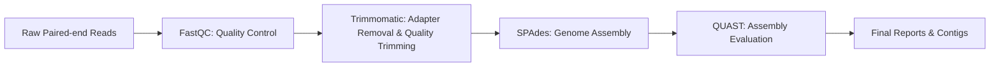

# 🧬 Bacterial Genome Assembly Pipeline

This repository contains a **Bash-based pipeline** for processing and assembling bacterial genomes from paired-end Illumina reads.  
It includes **pre-processing**, **assembly**, and **quality assessment** steps, and is designed to handle multiple samples in one run.

---

## 📋 Overview

### **Workflow**

